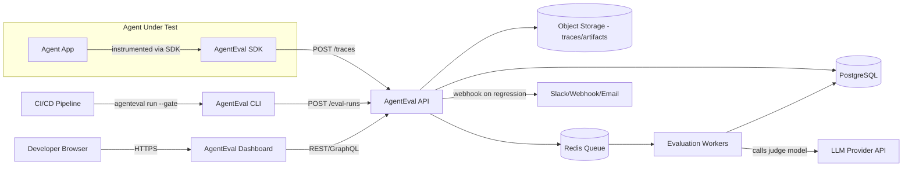
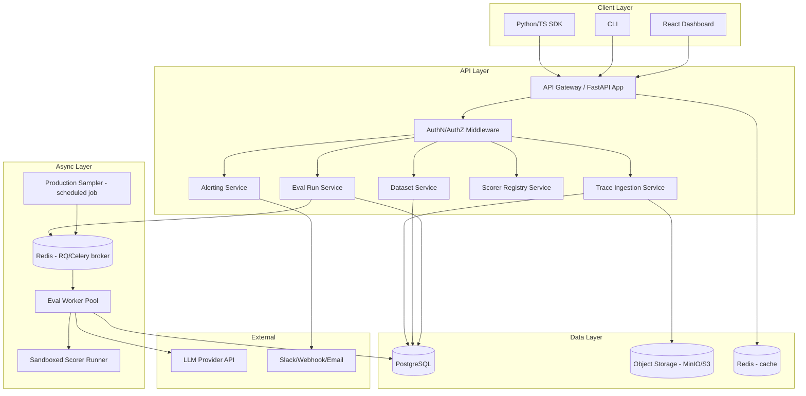
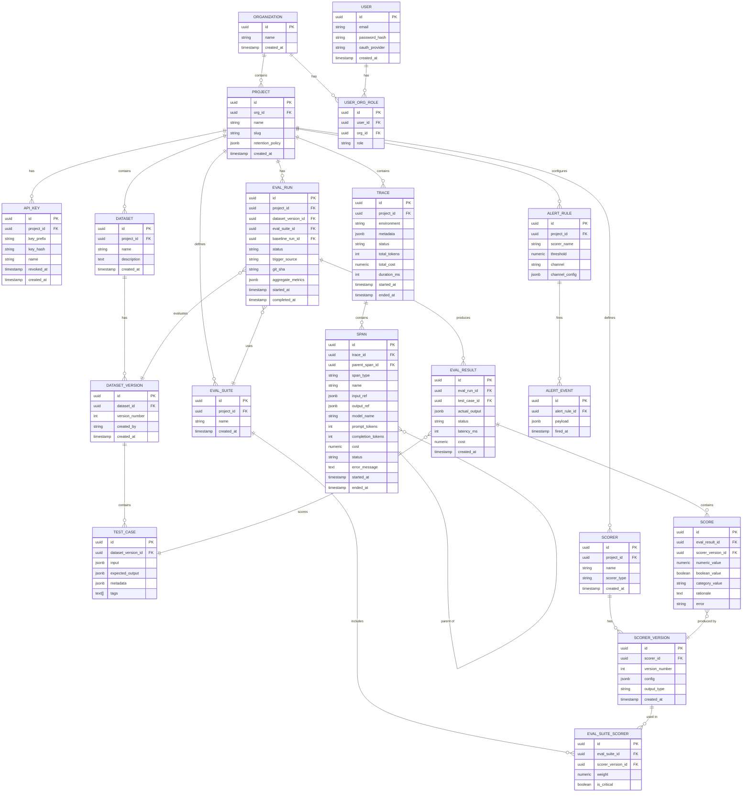
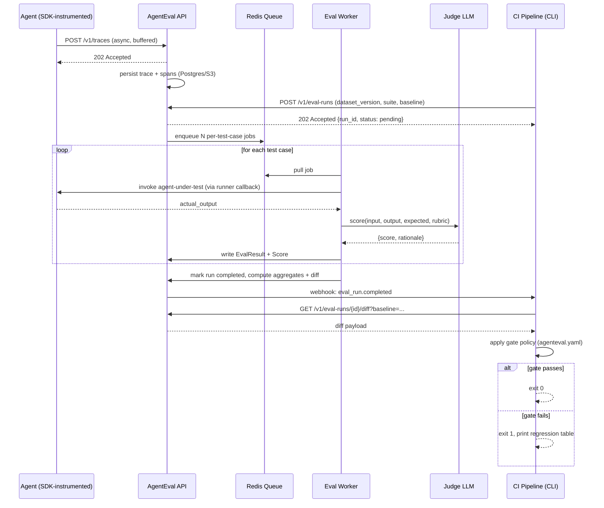
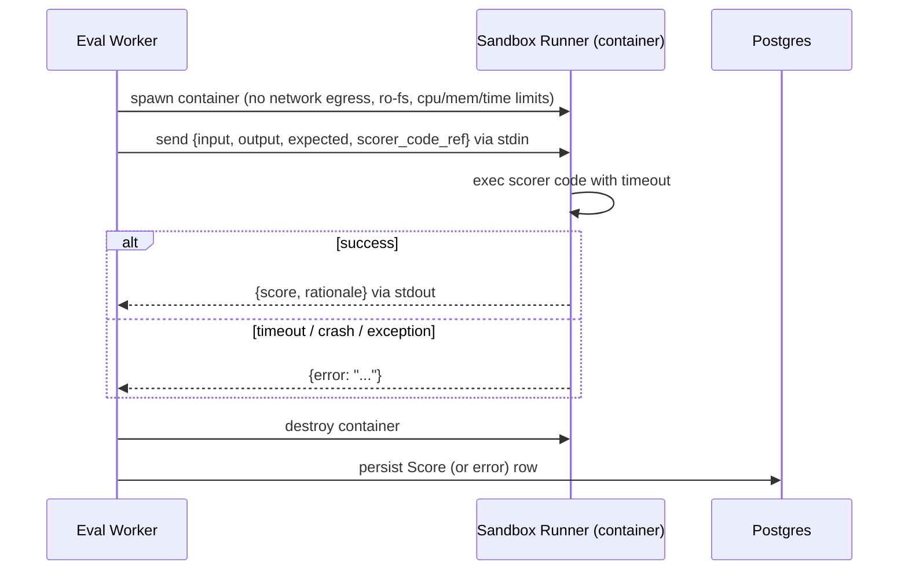
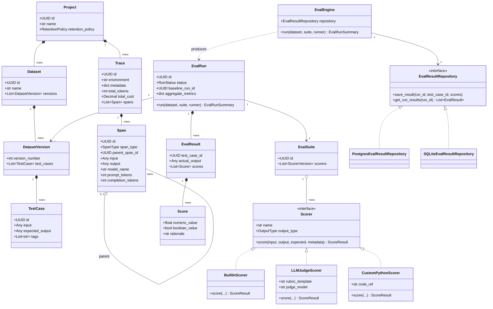

# Software Requirements Specification (SRS)
# Open-Source Agent Evaluation & Regression Testing Framework

**Codename:** AgentEval (rename as you like)
**Document type:** SRS + Cahier des Charges (IEEE 830 / ISO 29148–aligned)
**Version:** 1.0
**Status:** Draft for implementation

---

## 1. Introduction

### 1.1 Purpose
This document specifies the requirements for **AgentEval**, a self-hosted, open-source platform that captures the execution traces of LLM-powered agents, evaluates those traces against configurable quality rubrics, and gates CI/CD pipelines so regressions in agent behavior are caught before deployment — the same category of tool as Langfuse, Braintrust, or Arize Phoenix, built from scratch by you.

This SRS is written to be implementation-ready: every requirement is specific enough to become a ticket, and every architectural decision is justified so you do not need to re-architect mid-build.

### 1.2 Scope
AgentEval will:
- Ingest **traces** (multi-step agent runs: LLM calls, tool calls, retrievals, reasoning steps) via an SDK or direct API.
- Run **evaluations** ("scorers") against traces or against a curated **dataset** of test cases — deterministic scorers (exact match, regex, JSON schema), statistical scorers (BLEU/ROUGE/embedding similarity), and **LLM-as-judge** scorers with custom rubrics.
- Support **regression testing**: define an expected baseline, run new agent versions against the same dataset, and diff results.
- **Gate CI/CD**: expose a CLI/GitHub Action that fails a build if aggregate scores drop below a threshold or below the previous baseline.
- Provide a **dashboard** for trace inspection, score trends over time, and dataset/test-case management.
- Provide **alerting** (webhook/Slack/email) on regression detection in production monitoring mode.
- Be **self-hostable** via Docker Compose (dev) and Kubernetes/Helm (production), API-first, multi-tenant capable.

Out of scope for v1 (explicitly, to prevent scope creep): training/fine-tuning models, hosting/serving LLMs, building agents themselves (AgentEval evaluates agents, it does not build them), a no-code agent builder UI.

### 1.3 Intended Audience
You (solo builder/portfolio author), future open-source contributors, and any engineer evaluating the project's design (recruiters, interviewers) reading the repo.

### 1.4 Definitions

| Term | Definition |
|---|---|
| **Trace** | A complete record of one agent execution: an ordered tree of spans. |
| **Span** | A single step within a trace (one LLM call, one tool call, one retrieval). |
| **Dataset** | A named collection of test cases (input + expected output/rubric) used for offline regression evaluation. |
| **Test case** | One input/expected-output pair, optionally with per-case scoring rubric overrides. |
| **Scorer** | A pluggable function that assigns a numeric or boolean score to a trace/span/test-case result. |
| **Eval run** | An execution of a set of scorers against a dataset or a batch of production traces, producing an `EvalResult` per test case + aggregate metrics. |
| **Baseline** | A previous eval run designated as the comparison point for regression detection. |
| **Gate** | A CI/CD-facing decision (pass/fail) derived from comparing a new eval run to a baseline against configured thresholds. |
| **Judge model** | An LLM used as a scorer to assess subjective qualities (helpfulness, faithfulness, safety) via a rubric prompt. |

### 1.5 References
- OpenTelemetry Semantic Conventions for Generative AI (tracing data model inspiration)
- IEEE 830-1998 / ISO/IEC/IEEE 29148:2018 (SRS structure)
- OWASP ASVS (security requirements baseline)

---

## 2. Overall Description

### 2.1 Product Perspective
AgentEval is a standalone, self-hosted system. It is agent-framework-agnostic: it does not care whether the traced agent was built with LangGraph, a hand-rolled loop, or a raw API — it only requires traces to be submitted in AgentEval's schema (via a thin SDK that wraps any framework).

### 2.2 System Context Diagram



### 2.3 User Classes and Characteristics

| User class | Description | Key needs |
|---|---|---|
| **Agent Developer** | Builds the agent being evaluated | Fast local iteration, clear failure diagnostics, SDK simplicity |
| **ML/AI Engineer** | Designs scorers/rubrics, curates datasets | Flexible scorer API, dataset versioning, statistical rigor |
| **DevOps/Platform Engineer** | Wires AgentEval into CI/CD | Reliable CLI exit codes, config-as-code, low operational overhead |
| **Engineering Manager** | Reviews quality trends | Dashboards, trend charts, exportable reports |
| **Admin** | Manages orgs/projects/users/API keys | RBAC, audit logs, key rotation |

### 2.4 Operating Environment
- Backend: Linux containers (Docker), Kubernetes for production.
- Database: PostgreSQL 15+.
- Cache/Queue: Redis 7+.
- Frontend: modern evergreen browsers (Chrome/Firefox/Edge/Safari, last 2 versions).
- SDKs: Python 3.10+ first-class; TypeScript/Node 18+ second-class (v2).

### 2.5 Design and Implementation Constraints
- Must run fully self-hosted with **zero mandatory external SaaS dependency** (an external LLM API for judge scoring is optional/pluggable, with a local-model fallback path).
- Must be usable as a **library** (import and call directly in Python, no server required, for local dev) *and* as a **hosted service** (API + workers) — this dual-mode requirement is the single most important architectural driver (see §5.6).
- Licensing: MIT or Apache-2.0 (portfolio/open-source distribution).

### 2.6 Assumptions and Dependencies
- Assumes traced agents can be instrumented (wrap LLM calls / tool calls with the SDK) — no black-box network-sniffing ingestion in v1.
- Assumes at least one LLM provider API key is available for LLM-as-judge scorers (OpenAI/Anthropic/local via Ollama — pluggable).

---

## 3. Functional Requirements

Requirements use the format **FR-\<module\>-\<n\>** with a MUST/SHOULD/MAY priority (RFC 2119 style).

### 3.1 Module: Authentication & Authorization
- **FR-AUTH-1 (MUST):** System supports API-key authentication for programmatic access (SDK, CLI, CI).
- **FR-AUTH-2 (MUST):** System supports email/password authentication for the dashboard, with hashed (Argon2id) password storage.
- **FR-AUTH-3 (SHOULD):** System supports OAuth2/OIDC login (GitHub) for the dashboard.
- **FR-AUTH-4 (MUST):** System implements role-based access control with roles: `owner`, `admin`, `member`, `viewer`, scoped per organization and per project.
- **FR-AUTH-5 (MUST):** API keys are scoped to a project and can be revoked; revocation takes effect within 60 seconds (cache TTL).
- **FR-AUTH-6 (MUST):** All authentication failures are logged to an audit log (no sensitive data in logs).

### 3.2 Module: Organizations, Projects, Datasets
- **FR-ORG-1 (MUST):** A user can create an Organization; an Organization contains one or more Projects.
- **FR-ORG-2 (MUST):** A Project is the unit of isolation for traces, datasets, scorers, and eval runs.
- **FR-DS-1 (MUST):** A user can create a Dataset (named, versioned) containing Test Cases (input, expected_output, metadata, tags).
- **FR-DS-2 (MUST):** Test Cases can be created via UI, bulk CSV/JSONL import, or programmatically via API/SDK.
- **FR-DS-3 (MUST):** Datasets are versioned; every edit to test cases creates a new immutable Dataset Version. Eval runs always reference a specific Dataset Version (reproducibility requirement).
- **FR-DS-4 (SHOULD):** Test cases can be tagged and filtered (e.g., `category:refund`, `difficulty:hard`) to allow slicing metrics by segment.

### 3.3 Module: Trace Ingestion
- **FR-TRACE-1 (MUST):** SDK provides a decorator/context-manager to wrap an agent run as a Trace, and nested decorators to wrap sub-steps as Spans, without requiring a running server (spans buffer locally and flush async).
- **FR-TRACE-2 (MUST):** Each Span records: type (`llm_call`|`tool_call`|`retrieval`|`custom`), input, output, start/end timestamps, token usage (prompt/completion), cost estimate, model name, parent span id, status (`ok`|`error`), error message if applicable.
- **FR-TRACE-3 (MUST):** API accepts trace ingestion via `POST /v1/traces` (single) and `POST /v1/traces/batch` (bulk), idempotent via client-supplied `trace_id` (UUID).
- **FR-TRACE-4 (MUST):** Large payloads (>256KB per span, e.g. images/long documents) are stored in object storage with a reference, not inline in Postgres.
- **FR-TRACE-5 (SHOULD):** SDK supports automatic instrumentation for common frameworks (LangChain/LangGraph callback handler, OpenAI/Anthropic SDK wrapper) in addition to manual instrumentation.
- **FR-TRACE-6 (MUST):** Traces support arbitrary user-defined metadata (session_id, user_id, environment, git_sha) for filtering.

### 3.4 Module: Scorers
- **FR-SCORE-1 (MUST):** System ships built-in scorers: `exact_match`, `contains`, `regex_match`, `json_schema_valid`, `levenshtein_similarity`, `embedding_similarity` (cosine sim via a local embedding model), `latency_threshold`, `cost_threshold`.
- **FR-SCORE-2 (MUST):** System supports **LLM-as-judge** scorers: user supplies a rubric prompt template with `{input}`, `{output}`, `{expected}` placeholders; judge returns a structured score (0-1 or categorical) + rationale, enforced via structured output (JSON schema / tool call).
- **FR-SCORE-3 (MUST):** System supports **custom Python scorers**: user provides a function `score(input, output, expected, metadata) -> ScoreResult`, registered and executed inside a sandboxed worker (see NFR-SEC-3).
- **FR-SCORE-4 (SHOULD):** System supports **trajectory scorers** that evaluate the full span tree (e.g., "did the agent call tools in a valid order", "did it avoid a forbidden tool", "how many steps did it take").
- **FR-SCORE-5 (MUST):** Each scorer declares its output type (`boolean`, `numeric[0,1]`, `categorical`) and is versioned; changing a scorer's logic creates a new Scorer Version so historical eval runs remain reproducible/comparable.
- **FR-SCORE-6 (SHOULD):** System supports scorer composition — a named "Eval Suite" bundles multiple scorers with weights for a single aggregate score.

### 3.5 Module: Evaluation Engine / Eval Runs
- **FR-EVAL-1 (MUST):** A user (or CI) can trigger an Eval Run: given a Dataset Version + an agent output source (either live-call-the-agent-under-test via a supplied callback, or a pre-computed set of outputs) + an Eval Suite, execute every scorer against every test case.
- **FR-EVAL-2 (MUST):** Eval Runs execute asynchronously via a job queue; scorer calls to external judge LLMs are parallelized with configurable concurrency and rate-limit backoff.
- **FR-EVAL-3 (MUST):** Eval Run produces: per-test-case `EvalResult` (score per scorer, pass/fail, rationale/error), and run-level aggregates (mean score per scorer, pass rate, p50/p95 latency, total cost).
- **FR-EVAL-4 (MUST):** A user can designate any Eval Run as the **Baseline** for a dataset+suite combination.
- **FR-EVAL-5 (MUST):** System computes a **diff** between a new Eval Run and the Baseline: which test cases newly failed, newly passed, or changed score beyond a configurable delta.
- **FR-EVAL-6 (SHOULD):** System supports statistical significance testing (bootstrap confidence interval or paired t-test) on aggregate score deltas to avoid false-positive regressions from noise, especially relevant since LLM outputs are non-deterministic.
- **FR-EVAL-7 (MUST):** Eval Run status is queryable (`pending`, `running`, `completed`, `failed`, `partial`) and supports webhooks on completion.

### 3.6 Module: CI/CD Gating
- **FR-CI-1 (MUST):** CLI command `agenteval run --dataset <name> --suite <name> --gate` executes an eval run against a locally running agent (via a user-provided runner script/callback) and exits non-zero if the gate fails.
- **FR-CI-2 (MUST):** Gate policy is configurable (`agenteval.yaml`): fail if mean score < threshold, fail if any test case in a `critical` tag fails, fail if regression vs. baseline exceeds delta, fail if p95 latency/cost exceeds budget.
- **FR-CI-3 (MUST):** CLI outputs a human-readable summary table to stdout and a machine-readable JSON report to a file (for CI artifact upload).
- **FR-CI-4 (MUST):** A reference **GitHub Action** is provided that wraps the CLI, posts a PR comment with the diff-vs-baseline table, and sets a commit status check.
- **FR-CI-5 (SHOULD):** Gate supports a "warn only" mode (non-blocking) for gradual rollout of new scorers.

### 3.7 Module: Production Monitoring
- **FR-MON-1 (SHOULD):** Traces ingested from a live production agent (tagged `environment:production`) can be automatically sampled and scored on a schedule (e.g., score 5% of traces hourly) without a formal Eval Run/dataset.
- **FR-MON-2 (SHOULD):** If the rolling average of a monitored scorer drops below a threshold, an alert fires via configured channel (Slack webhook, generic webhook, email).
- **FR-MON-3 (MAY):** Human-in-the-loop review queue: flag low-confidence or low-score production traces for manual annotation, and allow promoting annotated examples into a Dataset (closing the loop from production issues to regression tests).

### 3.8 Module: Dashboard / Frontend
- **FR-UI-1 (MUST):** Trace explorer: list/filter/search traces, view a trace's span tree as a waterfall/timeline, inspect input/output/tokens/cost per span.
- **FR-UI-2 (MUST):** Dataset manager: CRUD test cases, view dataset version history, bulk import/export (CSV/JSONL).
- **FR-UI-3 (MUST):** Eval Run view: table of per-test-case results (sortable/filterable by pass/fail/tag), aggregate score cards, and a baseline-diff view highlighting regressions in red / improvements in green.
- **FR-UI-4 (MUST):** Trend dashboard: line charts of aggregate scores, cost, and latency over time (per scorer, per project), selectable date range.
- **FR-UI-5 (SHOULD):** Scorer/Eval Suite builder UI (create/edit scorers, rubric prompts, weights) with a "test this scorer on one example" preview.
- **FR-UI-6 (MUST):** Settings pages: API key management, team/member management, webhook/alert configuration.
- **FR-UI-7 (SHOULD):** Dark mode, responsive layout (desktop-first, usable on tablet).

### 3.9 Module: API & SDK
- **FR-API-1 (MUST):** All server functionality is exposed via a documented REST API (OpenAPI 3.1 spec auto-generated).
- **FR-API-2 (MUST):** API is versioned (`/v1/...`), with additive-only changes preferred over breaking changes; breaking changes require a `/v2/`.
- **FR-API-3 (MUST):** Python SDK (`pip install agenteval`) provides: trace/span instrumentation decorators, a `Client` for programmatic dataset/eval-run management, and can run entirely offline against a local SQLite store for pure-local usage (no server) — see §2.5 dual-mode constraint.
- **FR-API-4 (SHOULD):** CLI (`agenteval`) is a thin wrapper over the SDK/API for CI usage.

---

## 4. Non-Functional Requirements

### 4.1 Performance
- **NFR-PERF-1:** Trace ingestion API must accept a single trace with up to 200 spans in < 150ms p95 (excluding network).
- **NFR-PERF-2:** Dashboard trace list queries (paginated, 50 rows) must return in < 300ms p95 for projects with up to 10M traces, assuming proper indexing (see §6).
- **NFR-PERF-3:** Evaluation workers must process at least 20 LLM-as-judge scorer calls/second per worker replica, bounded by provider rate limits, via async I/O (not thread-per-request).
- **NFR-PERF-4:** CLI gate command overhead (excluding actual agent execution + scorer LLM calls) must add < 2s to a CI run.

### 4.2 Scalability
- **NFR-SCALE-1:** Evaluation workers must be horizontally scalable (stateless, pull jobs from Redis/queue); adding workers linearly increases eval throughput.
- **NFR-SCALE-2:** System must support multi-tenancy: hundreds of projects, millions of traces, without cross-tenant data leakage (enforced at the query layer, not just the UI).
- **NFR-SCALE-3:** Trace storage must support partitioning/retention policies (e.g., raw span payloads older than 90 days moved to cold object storage or deleted per project config).

### 4.3 Availability & Reliability
- **NFR-AVAIL-1:** API must target 99.5% uptime for self-hosted production deployments (documented SLO, not enforced by the software itself).
- **NFR-AVAIL-2:** Trace ingestion must not block or fail the calling agent: SDK buffers and retries with exponential backoff; if the server is unreachable, spans are persisted locally (disk queue) and flushed later — **the agent under test must never crash or slow down meaningfully because AgentEval is down.**
- **NFR-AVAIL-3:** Evaluation jobs must be idempotent and resumable: a worker crash mid-run must not corrupt the Eval Run; incomplete runs are marked `partial` and can be retried per-test-case.

### 4.4 Security
- **NFR-SEC-1:** All API traffic must be over TLS in production; local dev may use HTTP.
- **NFR-SEC-2:** Secrets (LLM provider API keys, DB credentials, webhook secrets) must never be stored in plaintext in the database; use envelope encryption (e.g., encrypted at rest via a KMS-derived key or, minimally, AES-256-GCM with a server-side master key from environment/secret manager).
- **NFR-SEC-3:** Custom Python scorer execution (FR-SCORE-3) MUST run in an isolated sandbox (gVisor/Docker container with no network egress except allow-listed judge-LLM endpoints, read-only filesystem, CPU/memory/time limits) — this is a **critical** security requirement since it is arbitrary user code execution.
- **NFR-SEC-4:** All inputs are validated server-side (Pydantic schemas) regardless of client-side validation.
- **NFR-SEC-5:** Rate limiting on all public API endpoints (per API key, sliding window).
- **NFR-SEC-6:** Dependency vulnerability scanning in CI (pip-audit / npm audit / Trivy for container images) on every merge to main.
- **NFR-SEC-7:** OWASP ASVS Level 1 baseline compliance for the web application (auth, session management, input validation, output encoding).

### 4.5 Maintainability
- **NFR-MAINT-1:** Backend code coverage ≥ 80% for core evaluation-engine and API logic (excluding pure I/O glue).
- **NFR-MAINT-2:** All public API endpoints and SDK functions have docstrings sufficient to auto-generate reference docs.
- **NFR-MAINT-3:** Database schema changes are managed exclusively through versioned migrations (Alembic); no manual schema edits.

### 4.6 Usability
- **NFR-USE-1:** A new user can go from `docker compose up` to seeing their first ingested trace in the dashboard in under 10 minutes, following the README quickstart.
- **NFR-USE-2:** Error messages (API and CLI) must state what went wrong and how to fix it, not just an error code.

### 4.7 Portability
- **NFR-PORT-1:** Entire stack runs via Docker Compose on Linux/macOS/WSL2 with no cloud dependency for local development.
- **NFR-PORT-2:** LLM provider for judge scoring is pluggable via an adapter interface (OpenAI, Anthropic, local via Ollama/vLLM) — no hard dependency on a single vendor.

### 4.8 Observability (of AgentEval itself)
- **NFR-OBS-1:** Backend exposes Prometheus metrics (`/metrics`): request latency histograms, queue depth, worker throughput, error rates.
- **NFR-OBS-2:** Structured JSON logging throughout (correlation/request IDs propagated end-to-end).
- **NFR-OBS-3:** A reference Grafana dashboard JSON is shipped in the repo (`ops/grafana/`).

---

## 5. System Architecture

### 5.1 Architectural Style
**Modular monolith backend + separate stateless worker pool + SPA frontend**, communicating over REST, backed by Postgres (system of record) + Redis (queue/cache) + S3-compatible object storage (large payloads). A modular monolith (not microservices) is the correct choice here: at your team size (one person) and this scale, microservices add operational overhead without a corresponding benefit — the API and workers are separated only where it matters for scaling (CPU/IO-bound eval workers vs. request-serving API).

### 5.2 High-Level Component Diagram



### 5.3 Backend Components (responsibilities)

| Component | Responsibility |
|---|---|
| **API Gateway (FastAPI)** | HTTP routing, request validation (Pydantic), OpenAPI generation, auth middleware, rate limiting |
| **Trace Ingestion Service** | Validates & persists traces/spans; offloads large payloads to object storage; enforces per-project retention |
| **Dataset Service** | CRUD for datasets/test cases; versioning logic (copy-on-write dataset versions) |
| **Eval Run Service** | Orchestrates eval runs: enqueues per-test-case scoring jobs, tracks run status, computes aggregates, computes baseline diffs |
| **Scorer Registry Service** | Stores scorer definitions (built-in, LLM-judge configs, custom code refs) and their versions |
| **Eval Worker Pool** | Pulls jobs from queue, executes scorers (calls judge LLM or sandboxed code), writes `EvalResult` rows |
| **Sandboxed Scorer Runner** | Executes untrusted custom Python scorer code in an isolated container (see NFR-SEC-3) |
| **Alerting Service** | Evaluates monitoring thresholds, dispatches webhook/Slack/email notifications |
| **Production Sampler** | Scheduled job (cron-like, via queue's periodic task feature) that samples production traces for monitoring scoring |

### 5.4 Frontend Architecture
- **Framework:** React + TypeScript, Vite build, TanStack Query for server state, TanStack Table for data grids, Recharts for trend charts, Tailwind + shadcn/ui for components.
- **Structure:** feature-folder architecture (`features/traces`, `features/datasets`, `features/eval-runs`, `features/scorers`, `features/settings`), each with its own API hooks, components, and types generated from the OpenAPI spec (via `openapi-typescript`) — **never hand-write API types**, generate them, or they will drift from the backend.
- **State:** server state via TanStack Query (cache, revalidation); minimal local/UI state via React state; no heavy global state library needed at this scale.
- **Auth:** JWT stored in httpOnly cookie (not localStorage, to reduce XSS token-theft risk) for dashboard sessions; API keys (bearer token) for programmatic access.

### 5.5 Data Flow: End-to-End Example
1. Agent developer instruments their agent with the SDK.
2. Agent runs; SDK buffers spans locally, flushes a completed Trace to `POST /v1/traces` asynchronously.
3. Trace Ingestion Service validates, stores span metadata in Postgres, large payloads in object storage, returns 202 Accepted immediately (non-blocking).
4. Developer defines a Dataset of test cases and an Eval Suite (scorers) via UI or SDK.
5. Developer (or CI) triggers an Eval Run: `POST /v1/eval-runs` with `dataset_version_id`, `suite_id`, and either a `runner_callback` (CLI-local execution) or pre-computed outputs.
6. Eval Run Service creates one job per test case, enqueues to Redis.
7. Eval Workers pick up jobs, execute each scorer (deterministic scorers run in-process; LLM-judge scorers call the provider API; custom scorers run in the sandbox), write `EvalResult` rows.
8. When all jobs for a run complete, Eval Run Service computes aggregates + baseline diff, marks run `completed`, fires a webhook if configured.
9. CLI (in CI) polls or receives the webhook, applies gate policy, exits 0/1 accordingly; GitHub Action posts a PR comment.
10. Dashboard queries `GET /v1/eval-runs/{id}` and renders the results table + diff view.

### 5.6 The Dual-Mode Constraint (critical design decision)
Because FR-API-3 requires the SDK to work **without a running server** (pure local dev loop), the core evaluation logic (scorer execution, aggregate computation, baseline diffing) must live in a **framework-agnostic Python package** (`agenteval-core`) that:
- Has zero dependency on FastAPI/Postgres/Redis.
- Is used **both** by the server-side Eval Worker (with Postgres as the backing store) **and** by the SDK/CLI running locally (with SQLite or an in-memory store as the backing store) via a repository-interface abstraction (`EvalResultRepository` with a Postgres implementation and a SQLite implementation).

This is the single most important architectural decision in the system — get this wrong (e.g., by putting evaluation logic directly in FastAPI route handlers) and you will face a full rewrite when you build the CLI. See Task Roadmap Phase 2 for how this is sequenced to avoid that trap.

---

## 6. Database Schema

### 6.1 Entity-Relationship Diagram



### 6.2 Key Indexing Strategy (must be planned before ingesting real data)
- `trace (project_id, started_at DESC)` — composite index for the trace explorer's default sort/filter.
- `span (trace_id)` and `span (parent_span_id)` — for reconstructing the span tree quickly.
- `eval_result (eval_run_id)` and `eval_result (test_case_id)` — for both the results table and the baseline-diff join.
- `score (eval_result_id, scorer_version_id)` — composite unique index (one score per scorer per result).
- `test_case` uses a GIN index on `tags` (array) for tag-based filtering.
- Partition `trace` and `span` tables by `project_id` range or by month (`started_at`) once trace volume passes ~10M rows — plan for this in the schema (a `partition_key` generated column) even if you don't activate partitioning on day one, per NFR-SCALE-3.

### 6.3 Large Payload Storage
`input_ref`/`output_ref` on `SPAN` are JSONB columns that store **either** the raw payload inline (if < 256KB, per FR-TRACE-4) **or** a `{"storage": "s3", "key": "..."}` reference. This keeps Postgres row sizes bounded and avoids TOAST bloat/slow scans on the hot trace tables.

---

## 7. API Design

### 7.1 Conventions
- Base path: `/v1`. JSON request/response. `Authorization: Bearer <api_key>` for programmatic access, session cookie for the dashboard.
- Pagination: cursor-based (`?cursor=...&limit=50`), not offset-based, to stay performant on large trace tables.
- Errors: RFC 7807 Problem Details format (`type`, `title`, `status`, `detail`, `instance`).
- All list endpoints support field-based filtering via query params and support `?fields=` sparse fieldsets for large objects (traces).

### 7.2 Core Endpoints

| Method | Path | Purpose |
|---|---|---|
| `POST` | `/v1/auth/login` | Dashboard login, returns session cookie |
| `POST` | `/v1/api-keys` | Create a project-scoped API key |
| `DELETE` | `/v1/api-keys/{id}` | Revoke a key |
| `POST` | `/v1/projects` | Create project |
| `POST` | `/v1/traces` | Ingest one trace (with nested spans) |
| `POST` | `/v1/traces/batch` | Bulk ingest |
| `GET` | `/v1/traces` | List/filter traces (cursor paginated) |
| `GET` | `/v1/traces/{id}` | Get one trace with full span tree |
| `POST` | `/v1/datasets` | Create dataset |
| `POST` | `/v1/datasets/{id}/versions` | Create a new immutable dataset version |
| `POST` | `/v1/datasets/{id}/versions/{v}/test-cases` | Add test case(s), or bulk import |
| `POST` | `/v1/scorers` | Register a scorer (built-in config, LLM-judge rubric, or custom code ref) |
| `POST` | `/v1/eval-suites` | Create eval suite (bundle of scorer versions + weights) |
| `POST` | `/v1/eval-runs` | Trigger an eval run |
| `GET` | `/v1/eval-runs/{id}` | Get run status + aggregate metrics |
| `GET` | `/v1/eval-runs/{id}/results` | Paginated per-test-case results |
| `GET` | `/v1/eval-runs/{id}/diff?baseline={id}` | Regression diff vs. a baseline run |
| `POST` | `/v1/eval-runs/{id}/set-baseline` | Mark a run as the baseline for its dataset+suite |
| `POST` | `/v1/alert-rules` | Configure monitoring alert |
| `GET` | `/v1/metrics/trends` | Time-series aggregate scores/cost/latency for dashboard charts |
| `GET` | `/openapi.json` | Auto-generated OpenAPI 3.1 spec |

### 7.3 Example: Trigger Eval Run (request/response)

```json
POST /v1/eval-runs
{
  "dataset_version_id": "ds_v_123",
  "eval_suite_id": "suite_456",
  "trigger_source": "ci",
  "git_sha": "a1b2c3d",
  "baseline_run_id": "run_789"
}

202 Accepted
{
  "id": "run_abc",
  "status": "pending",
  "total_test_cases": 120,
  "created_at": "2026-07-31T10:00:00Z"
}
```

### 7.4 Example: Eval Run Diff Response

```json
GET /v1/eval-runs/run_abc/diff?baseline=run_789
{
  "run_id": "run_abc",
  "baseline_id": "run_789",
  "aggregate_delta": { "faithfulness": -0.06, "pass_rate": -0.04 },
  "regressed_cases": [
    {"test_case_id": "tc_12", "scorer": "faithfulness", "baseline_score": 0.91, "new_score": 0.58}
  ],
  "improved_cases": [ ... ],
  "significance": { "faithfulness": {"p_value": 0.03, "significant": true} }
}
```

---

## 8. Agent Workflow & SDK Instrumentation

### 8.1 SDK Usage Pattern (manual instrumentation)

```python
from agenteval import trace, span, Client

client = Client(api_key="...", project="my-agent")  # or local mode: Client(local=True)

@trace(client=client, name="customer_support_agent")
def run_agent(user_query: str) -> str:
    with span(type="retrieval", name="fetch_kb_docs") as s:
        docs = retrieve(user_query)
        s.set_output(docs)

    with span(type="llm_call", name="generate_response", model="claude-sonnet-5") as s:
        response = call_llm(user_query, docs)
        s.set_output(response)

    return response
```

- `@trace` opens a Trace, generates a `trace_id`, and ensures flush-on-exit (even on exception — spans capture the error and the trace is still sent, satisfying NFR-AVAIL-2).
- `span()` context managers auto-nest under the current trace via a `contextvars`-based stack (thread-safe, async-safe).
- Flushing is async and non-blocking by default (background thread with a bounded queue); `client.flush()` is available for CLI/short-lived-script use where you need to guarantee delivery before process exit.

### 8.2 Automatic Instrumentation (framework adapters)
For LangChain/LangGraph: a `AgentEvalCallbackHandler` implements the framework's callback interface (`on_llm_start`, `on_tool_start`, etc.) and maps those events to spans automatically — no manual `span()` calls needed. This is built **after** manual instrumentation works end-to-end (see Task Roadmap), since it's a thin adapter over the same core primitives.

### 8.3 Sequence Diagram: Trace Ingestion → Eval Run → CI Gate



### 8.4 Sequence Diagram: Custom Scorer Sandboxed Execution



---

## 9. Evaluation Engine Design

### 9.1 Core Abstractions (`agenteval-core` package)

```python
class ScoreResult(BaseModel):
    numeric_value: float | None = None
    boolean_value: bool | None = None
    category_value: str | None = None
    rationale: str | None = None
    error: str | None = None

class Scorer(Protocol):
    name: str
    output_type: Literal["numeric", "boolean", "categorical"]
    def score(self, input: Any, output: Any, expected: Any, metadata: dict) -> ScoreResult: ...

class EvalResultRepository(Protocol):
    def save_result(self, run_id: str, test_case_id: str, scores: list[Score]) -> None: ...
    def get_run_results(self, run_id: str) -> list[EvalResult]: ...

class EvalEngine:
    def __init__(self, repository: EvalResultRepository, scorers: list[Scorer]): ...
    def run(self, dataset: Dataset, runner: Callable[[Any], Any]) -> EvalRunSummary: ...
```

This interface is what makes the dual-mode constraint (§5.6) concrete: the **server** wires `EvalEngine` to a `PostgresEvalResultRepository` and runs it inside a Celery/RQ task; the **CLI** wires the same `EvalEngine` to a `SQLiteEvalResultRepository` (or in-memory) and runs it in-process. Zero duplicated evaluation logic.

### 9.2 Built-in Scorer Implementations (reference)

| Scorer | Logic |
|---|---|
| `exact_match` | `output.strip() == expected.strip()` |
| `contains` | substring/keyword presence check |
| `regex_match` | user-supplied pattern match |
| `json_schema_valid` | validate `output` (parsed JSON) against a user-supplied JSON Schema |
| `levenshtein_similarity` | normalized edit distance → similarity in [0,1] |
| `embedding_similarity` | cosine similarity between `output` and `expected` embeddings (local sentence-transformers model, no external API needed — keeps a fully-offline path available) |
| `latency_threshold` | pass if trace duration_ms < configured threshold |
| `cost_threshold` | pass if trace total_cost < configured threshold |

### 9.3 LLM-as-Judge Scorer Design
- Rubric prompt is a template stored in `SCORER_VERSION.config`, e.g.:
  ```
  You are evaluating an AI agent's response for faithfulness to the retrieved context.
  Input: {input}
  Retrieved context: {context}
  Agent response: {output}
  Score from 0.0 (completely unfaithful/hallucinated) to 1.0 (fully faithful).
  Respond with a JSON object: {"score": <float>, "rationale": "<one sentence>"}.
  ```
- The judge call **must** use structured output (tool-calling / JSON mode) rather than parsing free text with regex — free-text parsing is the #1 source of flaky evaluation pipelines.
- Judge calls are cached: `(scorer_version_id, input_hash, output_hash)` → cached score, so re-running an eval run without changing outputs doesn't re-spend judge-LLM budget (important for cost, and for CI runs on unrelated file changes).
- Judge model choice is itself pluggable and should be **decoupled from the model being evaluated** where possible (using the same model to judge itself is a known bias risk) — document this as a best practice in the scorer-builder UI.

### 9.4 Aggregation & Statistical Significance
- Aggregates computed per Eval Run: mean/median per scorer, pass rate (test cases where all `is_critical` scorers passed), p50/p95 latency, total cost.
- For regression detection (FR-EVAL-6): since LLM-judge scores are noisy, a raw mean-score drop of e.g. 0.02 may be noise. Use a paired bootstrap (resample test cases with replacement, recompute the mean delta N times, check if the 95% CI excludes zero) to decide `significant: true/false` before flagging a regression — this is what separates a credible eval framework from a toy one, and it's worth calling out explicitly in your README/demo since it shows statistical maturity.

---

## 10. CI/CD Integration

### 10.1 Gate Configuration File (`agenteval.yaml`)

```yaml
project: my-agent
dataset: support-qa-v3
suite: core-quality-suite
runner: "python ci/run_agent.py"   # script that takes a test case input, prints JSON output to stdout
gate:
  mode: block          # block | warn
  min_mean_score:
    faithfulness: 0.85
    helpfulness: 0.80
  max_regression_delta: 0.05
  critical_tags: ["safety", "no_pii_leak"]
  max_p95_latency_ms: 4000
  max_total_cost_usd: 2.00
baseline: latest_main   # or a pinned eval_run_id
```

### 10.2 GitHub Action (reference implementation)

```yaml
name: agent-eval-gate
on: [pull_request]
jobs:
  eval:
    runs-on: ubuntu-latest
    steps:
      - uses: actions/checkout@v4
      - uses: actions/setup-python@v5
        with: { python-version: "3.11" }
      - run: pip install agenteval
      - run: agenteval run --config agenteval.yaml --gate --report-file eval-report.json
        env:
          AGENTEVAL_API_KEY: ${{ secrets.AGENTEVAL_API_KEY }}
          OPENAI_API_KEY: ${{ secrets.OPENAI_API_KEY }}
      - uses: actions/upload-artifact@v4
        if: always()
        with: { name: eval-report, path: eval-report.json }
      - uses: agenteval/pr-comment-action@v1
        if: always()
        with: { report-file: eval-report.json }
```

### 10.3 CLI Exit Code Contract
- `0`: gate passed.
- `1`: gate failed (threshold or regression breach) — **this is the code CI keys off of.**
- `2`: infrastructure/config error (e.g., can't reach API, invalid `agenteval.yaml`) — deliberately distinct from `1` so a flaky network doesn't silently look like a real regression to whoever reads the CI log later.

---

## 11. Metrics & Dashboards

### 11.1 Dashboard Views
1. **Overview** — org/project-level score trend sparklines, recent eval runs, open alerts.
2. **Traces** — filterable table + waterfall/timeline detail view (span tree, expandable, color-coded by span type/status).
3. **Datasets** — version history timeline, test-case table with tag filters, diff between two dataset versions.
4. **Eval Runs** — results table (test case | per-scorer score | pass/fail), baseline-diff toggle, aggregate score cards, cost/latency summary.
5. **Trends** — line charts (Recharts): score-over-time per scorer, cost-over-time, latency percentiles over time; selectable comparison across environments (staging vs. production).
6. **Scorers** — CRUD UI for scorer definitions, rubric editor with live "test on one example" preview panel.
7. **Settings** — API keys, team members/roles, webhook/alert configuration, retention policy.

### 11.2 Key Metrics Definitions (must be precise, not hand-wavy, since this is a "metrics product")
- **Pass rate** = (test cases where all `is_critical` scorers scored above their threshold) / (total test cases).
- **Regression** = a scorer's mean score on the new run is below the baseline's mean score by more than `max_regression_delta`, **and** the bootstrap significance test flags it as statistically significant (§9.4) — a non-significant drop is shown as "noise, not a regression" in the UI, not hidden, so users learn to trust the tool.
- **Cost per trace** = sum of `span.cost` for all spans in a trace (computed from provider token pricing tables, refreshable via config since prices change).

---

## 12. Security

### 12.1 Threat Model Summary

| Threat | Mitigation |
|---|---|
| Arbitrary code execution via custom scorers | Sandboxed, network-isolated, resource-limited container per execution (NFR-SEC-3) |
| Cross-tenant data leakage | Every query scoped by `project_id` derived from the authenticated principal, enforced at the repository layer (not just route handlers), plus row-level security policies in Postgres as defense-in-depth |
| API key leakage | Keys shown once at creation, stored as salted hash (never reversible), prefix-only shown thereafter (`ae_live_ab12***`), revocable, rate-limited |
| Secrets in traces (accidental PII/API keys logged in span input/output) | Configurable redaction rules (regex-based, e.g. mask patterns matching API-key formats, emails, credit-card numbers) applied at ingestion before persistence |
| Prompt injection against the judge LLM (via adversarial test-case content) | Structured-output enforcement + treating judge output as data, not instructions; judge rationale is never executed or interpolated back into prompts |
| Denial of service via ingestion flood | Per-API-key rate limiting + payload size limits |
| Dependency supply-chain vulnerabilities | Automated scanning in CI (NFR-SEC-6), pinned lockfiles |

### 12.2 AuthZ Enforcement Pattern
Every repository method takes an explicit `project_id` derived from the authenticated request context (never trusted from the request body) — this is enforced by a shared base repository class so a future contributor cannot accidentally introduce a cross-tenant leak by forgetting a `WHERE project_id = ...` clause in one query.

---

## 13. Testing Strategy

| Layer | Tooling | Coverage target | What it catches |
|---|---|---|---|
| Unit (core engine, scorers) | pytest | ≥ 85% | Scorer logic correctness, aggregation math, diff/significance logic |
| Unit (API layer) | pytest + httpx AsyncClient | ≥ 80% | Request validation, auth/authz edge cases, error formatting |
| Integration | pytest + testcontainers (real Postgres/Redis in Docker) | Key flows | Trace ingestion → storage → retrieval round-trip; eval run → worker → aggregate correctness |
| Contract | OpenAPI schema validation in CI | 100% of endpoints | Frontend/SDK types never silently drift from backend |
| E2E | Playwright | Critical user journeys (create dataset → run eval → view diff → gate in CI) | Full-stack regressions |
| Load | k6 or Locust | Ingestion + eval-run throughput vs. NFR-PERF targets | Performance regressions before release |
| Security | Sandboxed scorer escape tests (deliberately malicious test scorers: infinite loop, fork bomb, network call attempt) | All sandbox boundaries | Sandbox escape / resource exhaustion |
| Non-determinism handling | Golden-run replay tests with a fixed random seed / mocked judge responses | Deterministic scorer paths | Ensures the engine itself doesn't introduce flakiness independent of the LLM's inherent noise |

**Best practice:** mock the judge LLM in unit/integration tests (deterministic fixture responses) and reserve real judge-LLM calls for a small, explicitly-marked `@pytest.mark.live_llm` suite run manually/nightly — this keeps CI fast, free, and deterministic.

---

## 14. Deployment

### 14.1 Local Development — Docker Compose

```yaml
services:
  postgres:
    image: postgres:16
    environment: { POSTGRES_DB: agenteval, POSTGRES_PASSWORD: dev }
    volumes: ["pgdata:/var/lib/postgresql/data"]
  redis:
    image: redis:7
  minio:
    image: minio/minio
    command: server /data --console-address ":9001"
  api:
    build: ./backend
    depends_on: [postgres, redis, minio]
    ports: ["8000:8000"]
    env_file: .env
  worker:
    build: ./backend
    command: celery -A agenteval.worker worker -l info
    depends_on: [postgres, redis, minio]
    env_file: .env
  frontend:
    build: ./frontend
    ports: ["5173:5173"]
volumes:
  pgdata:
```

### 14.2 Production — Kubernetes / Helm
- Separate Deployments for `api` (HPA on CPU + request latency), `worker` (HPA on **queue depth**, not CPU — the correct autoscaling signal for a queue-consumer workload), and `frontend` (static assets behind a CDN, or served by the API's static file mount for a single-image deploy option).
- `StatefulSet`/managed service for Postgres in production (recommend managed Postgres over self-hosting the DB, even in an otherwise self-hosted stack — the DB is the single most operationally risky component to run yourself).
- `Ingress` with TLS termination (cert-manager + Let's Encrypt for OSS users).
- Helm chart exposes values for: replica counts, resource limits, external DB/Redis connection strings (for users who want managed data stores), judge LLM provider config, retention policy defaults.
- Migrations run as a Helm pre-upgrade hook Job (`alembic upgrade head`), never on pod startup (avoids race conditions with multiple replicas starting simultaneously).

### 14.3 CI/CD for AgentEval Itself (dogfooding note)
The project's own CI: lint (ruff/eslint) → unit tests → build Docker images → integration tests (testcontainers) → (on tag) push images to GHCR + publish Python package to PyPI + publish Helm chart. As a nice portfolio touch, once the evaluation engine itself is stable, add a small internal "AgentEval evaluates its own example agent" step in CI — dogfooding your own tool is a strong signal in a project README.

---

## 15. Technology Stack

| Layer | Choice | Rationale |
|---|---|---|
| Backend language/framework | Python 3.11, FastAPI | Async-native, auto OpenAPI generation, strong typing via Pydantic v2 |
| Core evaluation engine | Pure Python package, zero web framework deps | Enables dual-mode (server + local CLI) per §5.6 |
| Database | PostgreSQL 16 | JSONB for flexible metadata, mature, widely deployable |
| ORM/Migrations | SQLAlchemy 2.0 (async) + Alembic | Type-safe queries, battle-tested migration tooling |
| Queue/Broker | Redis 7 + Celery (or RQ for simplicity — pick RQ if you want less operational complexity for v1) | Mature async job processing, horizontal scalability |
| Object storage | MinIO (self-hosted, S3-compatible) / AWS S3 in prod | Large payload offload, standard API |
| Sandbox runtime | Docker-in-Docker or gVisor (`runsc`) | Isolation for custom scorer execution |
| Frontend | React 18 + TypeScript + Vite | Fast dev loop, huge ecosystem, generatable types from OpenAPI |
| UI components | Tailwind CSS + shadcn/ui | Consistent, accessible, no heavy design-system lock-in |
| Charts | Recharts | Simple declarative charts sufficient for trend dashboards |
| Data grid | TanStack Table | Headless, performant for large result tables |
| Server state | TanStack Query | Caching/revalidation without a heavy global store |
| Auth | JWT (httpOnly cookie) + API keys (hashed) | Standard, secure defaults |
| Embeddings (local scorer) | sentence-transformers (e.g. `bge-small-en`) | Keeps `embedding_similarity` scorer fully offline-capable |
| Judge LLM adapters | OpenAI, Anthropic, Ollama (pluggable interface) | Vendor neutrality (NFR-PORT-2) |
| Observability | Prometheus + Grafana, structlog | Standard self-hostable stack |
| CI | GitHub Actions | Free for OSS, native GitHub PR integration |
| Container orchestration | Docker Compose (dev), Kubernetes + Helm (prod) | Matches NFR-PORT-1 and production scalability needs |
| Testing | pytest, testcontainers, Playwright, k6 | Full pyramid coverage per §13 |

---

## 16. Folder Structure (Monorepo)

```
agenteval/
├── backend/
│   ├── agenteval_core/          # framework-agnostic evaluation engine (§5.6, §9.1)
│   │   ├── scorers/             # built-in scorer implementations
│   │   ├── engine.py            # EvalEngine
│   │   ├── models.py            # Pydantic domain models (ScoreResult, EvalRunSummary, ...)
│   │   └── repository.py        # EvalResultRepository protocol + SQLite impl
│   ├── agenteval_api/           # FastAPI app
│   │   ├── routers/             # traces.py, datasets.py, eval_runs.py, scorers.py, auth.py, alerts.py
│   │   ├── services/            # business logic per module (§5.3)
│   │   ├── repositories/        # Postgres implementations of core protocols
│   │   ├── models/              # SQLAlchemy ORM models
│   │   ├── schemas/              # Pydantic request/response schemas
│   │   ├── middleware/          # auth, rate limiting, request logging
│   │   └── main.py
│   ├── agenteval_worker/        # Celery/RQ worker entrypoints, sandbox runner
│   ├── agenteval_sdk/           # pip-installable client SDK (trace/span decorators, Client)
│   ├── agenteval_cli/           # CLI (`agenteval` command), gate logic, GitHub Action glue
│   ├── migrations/              # Alembic
│   ├── tests/
│   │   ├── unit/
│   │   ├── integration/
│   │   └── load/
│   └── pyproject.toml
├── frontend/
│   ├── src/
│   │   ├── features/
│   │   │   ├── traces/
│   │   │   ├── datasets/
│   │   │   ├── eval-runs/
│   │   │   ├── scorers/
│   │   │   └── settings/
│   │   ├── api/                 # generated OpenAPI client + hooks
│   │   ├── components/          # shared UI primitives
│   │   ├── lib/
│   │   └── App.tsx
│   ├── e2e/                     # Playwright specs
│   └── package.json
├── examples/
│   └── example-support-agent/   # a small reference agent used for the demo + CI dogfooding
├── ops/
│   ├── docker-compose.yml
│   ├── helm/
│   └── grafana/
├── .github/
│   ├── workflows/                # ci.yml, release.yml
│   └── actions/agenteval-gate/   # reference composite Action
├── docs/
│   └── (SRS, ADRs, quickstart)
└── README.md
```

---

## 17. UML Class Diagram (Core Domain Model)



---

## 18. High-Level Milestones

| Milestone | Deliverable | Target (cumulative) |
|---|---|---|
| M0 | Repo scaffolding, `agenteval_core` engine with in-memory repo, built-in scorers, unit tests | Week 2 |
| M1 | SQLite-backed local mode fully working (`Client(local=True)`, no server needed) | Week 3 |
| M2 | FastAPI + Postgres API: trace ingestion + dataset CRUD, auth | Week 5 |
| M3 | Eval Run orchestration over Redis/Celery workers, LLM-judge scorer, baseline diff | Week 7 |
| M4 | CLI + GitHub Action gate, end-to-end CI demo repo | Week 8 |
| M5 | React dashboard: trace explorer, eval run view, trend charts | Week 10 |
| M6 | Custom scorer sandboxing, monitoring/alerting, production sampler | Week 11 |
| M7 | Security hardening, load testing, Helm chart, docs, polished README + demo video | Week 12–13 |

This document (SRS §1–18) is the reference for **what** to build. The companion document, **Implementation Roadmap & Task Breakdown**, sequences **how** to build it task-by-task without architectural rework.
